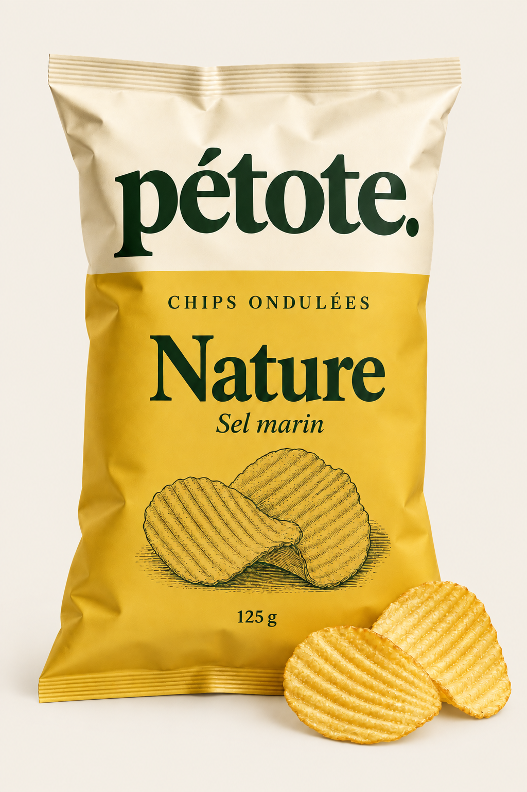
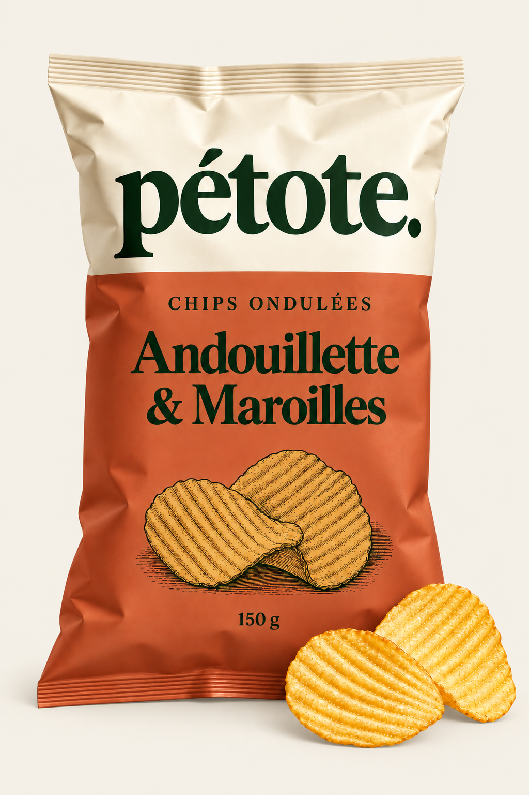
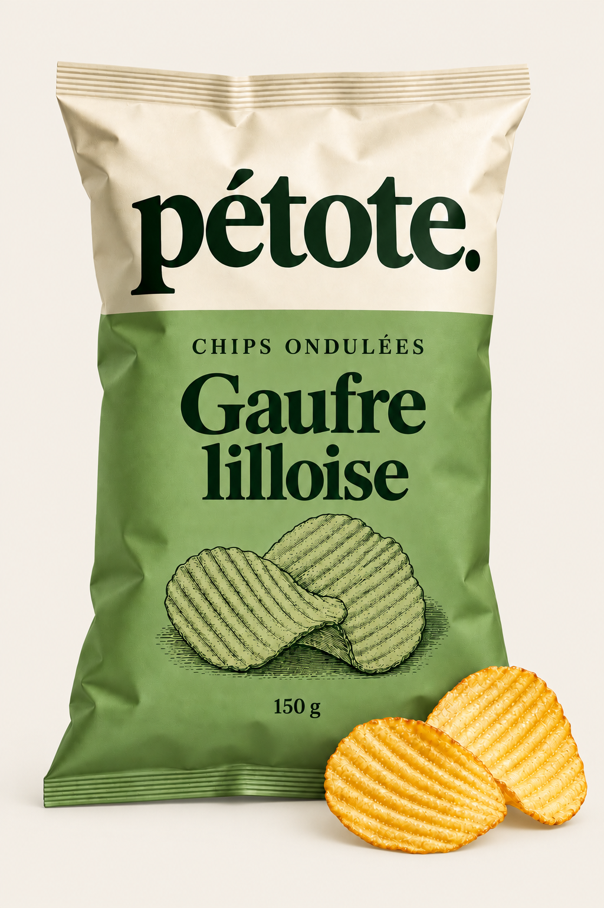
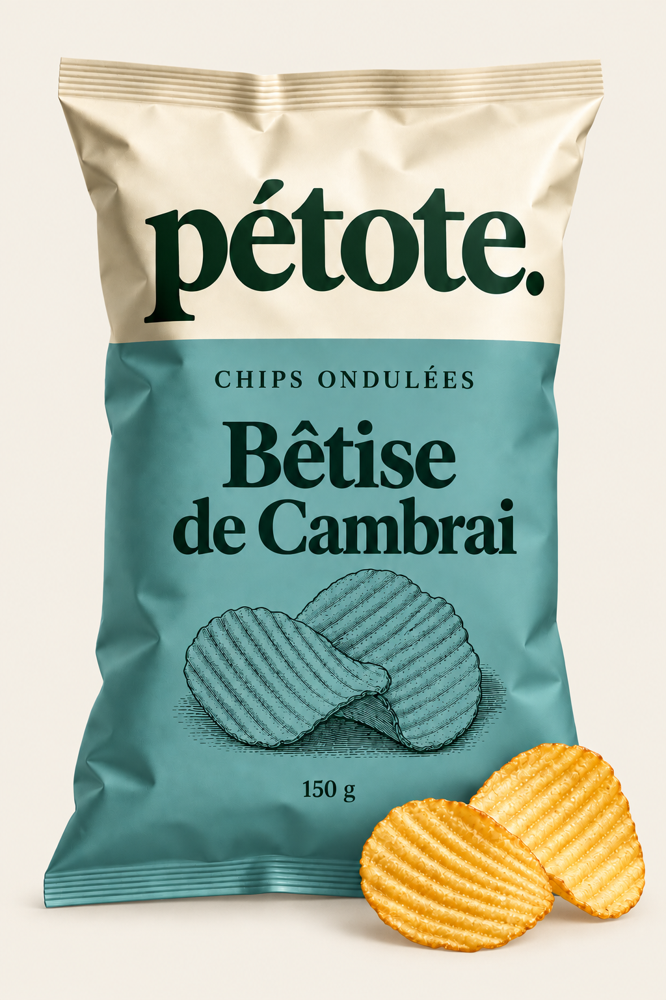

# Pétote POO

Application Flutter d'étude de cas BTS SIO, fondée sur **« Annexes EdC - Pétote.pdf »**. Le projet illustre la programmation orientée objet avec un catalogue de chips ondulées, une interface responsive et quatre packagings photoréalistes générés pour le devoir.

<p align="center">
  
  
  
  
</p>

## Périmètre

- Les quatre produits du premier catalogue, leurs références, poids, prix, goûts et types.
- Recherche, filtres salé/sucré et tri : uniquement des façons de consulter ces mêmes données.
- Fiches produit avec prix au kilo et simulation de remise en pourcentage.
- Valeur totale du catalogue : **9,50 €**, un exemplaire de chaque produit.
- Présentation de l'entreprise et annonce de la frite ondulée nature de 500 g, en coupe fine ou épaisse.

**Données entièrement en dur, images locales, aucun Docker, aucune API, base de données, shared_preferences ou sauvegarde persistante.** La génération des images a lieu pendant la conception : aucun service de génération n'est utilisé à l'exécution.

Il n'y a pas de panier, favoris, commande ou paiement. Aucune composition, certification, date de lancement, référence ou prix de frite n'est inventé.

## Démarrage

Avec le SDK Flutter installé et un appareil disponible :

```sh
flutter pub get --offline
flutter run
```

`--offline` utilise les dépendances déjà présentes dans le cache Flutter. Sur une première installation sans cache, lancer `flutter pub get` pour installer les dépendances de développement ; les données de l'application restent locales.

Pour le navigateur :

```sh
flutter run -d chrome --no-web-resources-cdn
```

Pour macOS, si l'outillage natif est installé : `flutter run -d macos`.

## Organisation

```text
lib/
├── main.dart                    # Point d'entrée, MaterialApp et thème
├── models/                      # Classes métier Dart, sans import Flutter
│   ├── produit.dart             # Classe abstraite, attributs et prix au kilo
│   ├── promotable.dart          # Interface des produits pouvant être remisés
│   ├── chips_ondulees.dart       # Héritage de Produit et implémentation du contrat
│   ├── gout.dart                # Nom, type et fabriques de goûts
│   └── catalogue.dart           # Collection polymorphe de Produit
├── data/
│   ├── catalogue_data.dart      # Instanciation des quatre produits de l'annexe
│   └── product_styles.dart      # Couleurs, noms courts et chemins des photos
├── screens/
│   ├── shop_screen.dart         # Navigation entre catalogue et entreprise
│   ├── catalogue_view.dart      # Recherche, filtre, tri et liste de produits
│   ├── product_detail.dart      # Fiche et simulateur de remise
│   └── story_view.dart          # Entreprise et future frite ondulée
├── widgets/                     # En-tête, bandeau, cartes, grille et photo
├── theme/app_theme.dart         # Palette et styles Material 3
└── utils/formatters.dart         # Affichage des euros et recherche sans accents
assets/images/                   # Quatre photos PNG incluses dans le dépôt
test/                            # Tests métier, images et interface
```

### Comment fonctionne la POO ?

1. **Encapsulation** : `Produit` garde `_reference`, `_nom`, `_poids` et `_prix` privés. Les getters permettent la lecture et les setters contrôlent les modifications. Le constructeur refuse un objet invalide ; `setPrix` ignore les valeurs nulles, négatives ou non finies et conserve le prix précédent.
2. **Abstraction** : `Produit` est abstraite. On ne l'instancie pas directement ; chaque sous-classe doit fournir `describe()`.
3. **Héritage** : `ChipsOndulees extends Produit` réutilise référence, nom, poids, prix et `calculerPrixAuKilo()`.
4. **Interface** : `ChipsOndulees implements Promotable` fournit `obtenirPrixPromo(remise)`. La formule est `prix * (1 - remise / 100)` ; la remise doit être comprise entre 0 et 100.
5. **Composition** : une chips possède un `Gout`, et un `Catalogue` contient une liste de `Produit`.
6. **Polymorphisme** : `donnerChipsOndulees()` parcourt la liste de produits et utilise `is ChipsOndulees`. Elle renvoie une nouvelle liste contenant uniquement les chips. `valeurTotale()` additionne les prix de tous les produits.

Le prix au kilo est calculé par `prix * 1000 / poids`, car le poids est exprimé en grammes.

### Comment fonctionne Flutter ?

`main()` démarre `PetoteApp`. `ShopScreen` crée le catalogue en mémoire, puis affiche la page sélectionnée. `CatalogueView` conserve trois valeurs dans son `State` : recherche, filtre et tri. Lorsqu'elles changent, `setState` reconstruit les widgets avec une sélection calculée à partir d'une copie du catalogue.

Chaque `ProductCard` reçoit un produit et un callback `onOpen`. Le clic ouvre `ProductDetail`. Son curseur appelle la méthode métier `obtenirPrixPromo()` : le calcul ne se trouve donc pas dans le widget et le prix d'origine n'est jamais modifié. La remise démarre à 0 et se réinitialise à chaque ouverture.

Les photos passent toutes par `ProductVisual`. La grille utilise `LayoutBuilder` et `Wrap` pour afficher une, deux ou quatre colonnes. Les vues restent défilables sur les petits écrans. Aucun gestionnaire d'état supplémentaire n'est nécessaire.

## Correspondance avec le PDF et corrections

| Annexe | Réalisation |
| --- | --- |
| Page 1, premier catalogue | Les quatre lignes sont reprises dans `catalogue_data.dart` |
| Pages 2 à 4, diagramme | Produit, ChipsOndulees, Promotable, Gout, Catalogue |
| Page 5, code incomplet | Constructeur, `setPrix`, prix au kilo et méthode abstraite |
| Pages 5 et 6, interface | Syntaxe Dart valide : `abstract interface class Promotable` |
| Page 6, goûts | Méthodes statiques et nom `gaufreLilloise()` corrigé (un seul f) |
| Pages 7 et 8, List et `is` | Ajout, sélection typée dans une nouvelle liste et total |

La gaufre lilloise reste classée **salé**, comme dans le tableau et la classe Gout du document. Il s'agit d'une donnée de l'annexe, pas d'une correction à deviner. La frite reste une annonce : l'annexe ne donne ni sa référence ni son prix. Aucune classe commerciale de frite à prix fictif n'est créée.

Les emballages sont des propositions graphiques photoréalistes, et non des photographies officielles. Les prompts, les noms des fichiers et les contraintes de contenu figurent dans [docs/IMAGES.md](docs/IMAGES.md).

## Vérification

```sh
flutter analyze --no-pub
flutter test --no-pub
flutter build web --no-pub --no-web-resources-cdn
```

Les 16 tests vérifient les données du PDF, les règles de prix, les remises, le polymorphisme, le décodage des quatre photos, les filtres, le tri, la fiche et la navigation à 320, 390, 768 et 1440 px, ainsi qu'en fenêtre basse et avec du texte agrandi.

La version web est compilée et contrôlée visuellement. Aucun build Android, iOS ou macOS n'est inclus dans cette validation.
